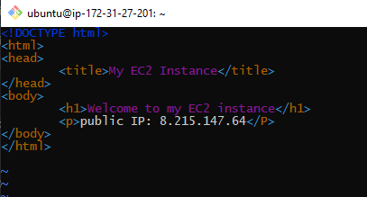

## Loadbalancing with Nginx

In this project we will be implementing a load balancer using Nginx. We will first create two EC2
instances and configure Apache server in them, then configure our nginx server to act as a load
balancer and direct traffic to these servers.


- step one: We provision our EC2 instances

- Create a key-pair for connection and in the same security group.

- Open port 8000 to allow traffic from anywhere for the instances

- Install Apache web server

To do this we will connect to the instances using SSH.

```
sudo apt update -y &&  sudo apt install apache2 -y
```


To confirm if Apache is up and running we run the code

```
sudo systemctl status apache2
```


- We will configure Apache2 to serve a page showing its public IPs using our text editor

```
sudo vi /etc/apache2/ports.conf
```

We add a new listen to the prots.conf file as shown below


Next we open the file /etc/apache2/sites-available/000-default.conf and change port 80 on the
virtualhost to 8000 as shown below.


For each of the opened file, since we use vim, we save and close the file using the below code

```
esc :wqa!
```

Next we restart Apache2

```
sudo systemctl restart apache2
```

- Now we create a html file and add our IP to the html boiler plate.

```
sudo vi index.html
```



- Change the file ownership of the index.html using the command below.

```
sudo chown www-data:www-data ./index.html
```

- Restart Apache2

```
sudo systemctl restart apache2
```

Below is the page of the created EC2 instances and their IP


- On the second part we configure Nginx as a load balancer, that way when traffic comes to the
  Nginx, it redirect it to any of the two servers.

- First we install Nginx into the instance using the command below

```
sudo apt update -y && sudo apt install nginx -y
```


- Verify Nginx is installed

```
sudo systemctl status nginx
```


- Now lets open the Nginx configuration file using the command below

```
sudo vi /etc/nginx/conf.d/loadbalancer.conf
```

- Then paste the configuration file below to configure nginx to act like a load balancer.


- We test configuration with the below code

```
sudo nginx -t
```

- Restart the nginx

```
sudo systemctl restart nginx
```

 

### The images above shows the load balancer displaying pages from both apache servers.
